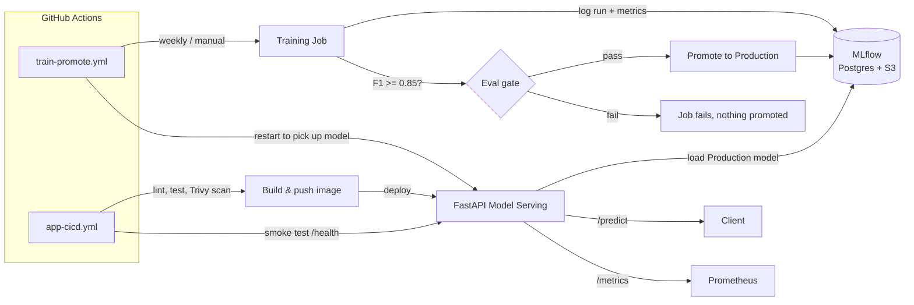

# MLOps Fraud Detection

An end-to-end MLOps pipeline for a fraud-detection model — training, evaluation-gated promotion, and serving — running on AWS EKS with GitOps-style CI/CD, IAM least privilege throughout, and full observability.

> Built to demonstrate MLOps ownership beyond "train a model": the infrastructure, the promotion gate that keeps a bad model out of production, and the delivery pipeline around both.

## Architecture



Training and serving are decoupled: a scheduled/manual workflow retrains and promotes a model only if it clears an F1 threshold, while a separate push-triggered workflow ships API code changes. The serving deployment only reloads the model when explicitly restarted after a successful promotion — an intentional decision so a bad training run can't silently swap out what's serving traffic.

## Components

| Component | Stack | Responsibility |
|---|---|---|
| `src/train.py` | scikit-learn, MLflow | Trains a `RandomForestClassifier`, logs params/metrics/model to MLflow, gates promotion on `test_f1 >= MIN_F1_THRESHOLD` (default 0.85) before transitioning the model to the `Production` stage |
| `src/app.py` | FastAPI, MLflow, Prometheus client | Loads the `Production` model from the MLflow registry at startup, serves `/predict`, exposes `/health`, `/ready`, and Prometheus metrics (`predictions_total`, `prediction_latency_seconds`, `predictions_positive_total`) labeled by client |
| MLflow | Postgres backend store, S3 artifact store | Experiment tracking and model registry, deployed as its own service in the cluster |

## Infrastructure (Terraform, AWS)

- **VPC** — public/private subnets across 2 AZs, single NAT gateway (cost-optimized for a portfolio cluster).
- **EKS** — cluster with IRSA enabled; the CI role gets an EKS access entry scoped to the `mlops` **namespace only**, not cluster-admin, so a compromised CI credential can't touch `kube-system` or anything else.
- **IAM via IRSA** — `mlflow-sa` gets read/write on the artifacts bucket, `fastapi-sa` gets **read-only**. No pod uses a shared or over-privileged role.
- **RDS (Postgres)** — MLflow's backend store, in a private subnet, security-grouped to accept connections only from EKS worker nodes.
- **S3** — MLflow artifact bucket, versioned, SSE-encrypted, all public access blocked.
- **ECR** — three repos (`fraud-detector`, `fraud-train`, `mlflow-server`) with a 14-day expiry lifecycle policy on untagged images.
- **GitHub OIDC** — CI assumes an AWS IAM role via GitHub's OIDC provider, scoped to this repo. No long-lived AWS access keys sit in GitHub Secrets.
- **AWS Load Balancer Controller** — installed via Helm, fronts both the API and MLflow with ALB Ingresses.

## CI/CD (GitHub Actions)

**`app-cicd.yml`** — triggered on pushes touching the API code:
1. Lint + test
2. Build image, scan with Trivy (fails the build on critical/high vulnerabilities)
3. Deploy via `kubectl set image`, syncing DB credentials from GitHub Secrets (never committed)
4. Smoke-test `/health` post-deploy

**`train-promote.yml`** — weekly schedule or manual dispatch:
1. Build the training image, run it as a Kubernetes `Job`
2. Wait for the job to complete — the F1 gate inside `train.py` is what makes the job succeed or fail, so a regressed model stops the pipeline here
3. Only on success: restart the serving deployment so it picks up the newly promoted model

## Local development

```bash
# Train locally against a local/remote MLflow instance
export MLFLOW_TRACKING_URI=http://localhost:5000
pip install -r src/requirements.txt
python src/train.py

# Serve
export MODEL_URI=models:/FraudDetector/Production
uvicorn src.app:app --reload --port 8000
```

Provisioning the AWS infrastructure:

```bash
cd terraform
cp terraform.tfvars.example terraform.tfvars   # fill in github_org / github_repo
export TF_VAR_db_password=<your-choice>        # never in a file
terraform init
terraform apply
```


## License

MIT — see `LICENSE`.
